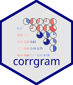
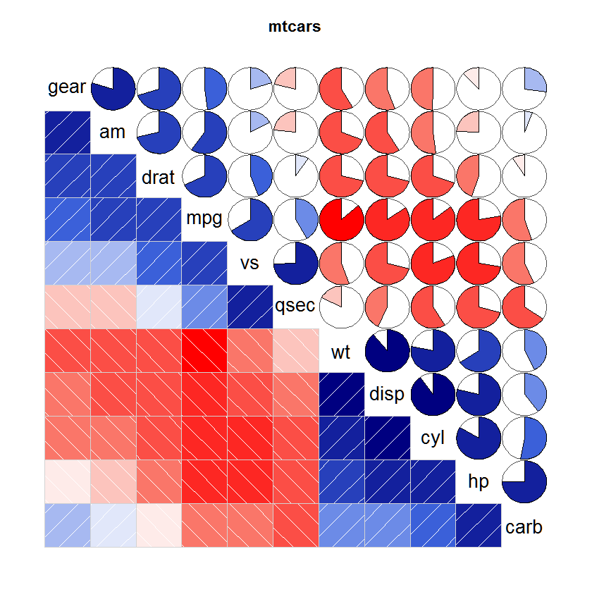

# corrgram  

[](https://cran.r-project.org/package=corrgram)
[](https://cranlogs.r-pkg.org/badges/corrgram)

Homepage: https://kwstat.github.io/corrgram

Repository: https://github.com/kwstat/corrgram

The `corrgram` package provides a simple way to create correlograms from raw data or a correlation matrix.

Key features:

* Stable, well-tested, widely used.

* Extensive examples show how to customize the display.

## Installation

```R
# Install the released version from CRAN:
install.packages("corrgram")

# Install the development version from GitHub:
install.packages("devtools")
devtools::install_github("kwstat/corrgram")
```

## Usage

```R
require(corrgram)
corrgram(mtcars, order=TRUE, lower.panel=panel.shade, upper.panel=panel.pie,
         text.panel=panel.txt, main="mtcars")
```

