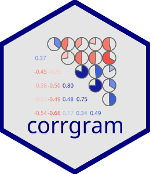
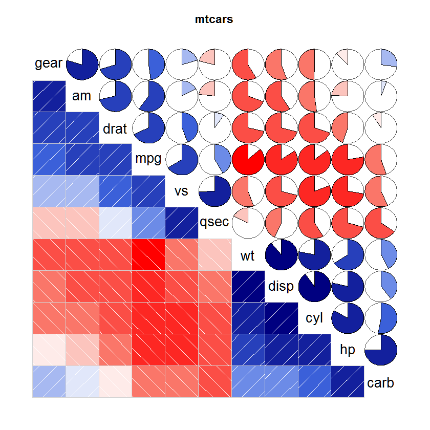

# corrgram  

[](https://cran.r-project.org/package=corrgram)
[](https://cranlogs.r-pkg.org/badges/corrgram)

Homepage: https://kwstat.github.io/corrgram

Repository: https://github.com/kwstat/corrgram

The `corrgram` package provides a simple way to create correlograms from raw data or a correlation matrix.

## Package overview

The `corrgram` package provides functions for creating corrgrams using three different graphics systems, base, grid, and lattice.

Base R graphics

+ single function `corrgram()` for dataframes or matrices.
+ Enables most features found in the paper by @friendly2002corrgrams.
- No automatic legend.
- Not easily combined with other graphics.

`lattice` graphics

+ Separate panel functions for `lattice::levelplot()` for dataframes and `lattice::splom()` for correlation matrices.
+ Enables automatic legend.
+ Enables corrgrams conditioned on other variables.
+ Can be combined with other lattice graphics for complex figures.
- Not feature complete compared to base R.

`grid` graphics

+ single function `corrgram2()` for either dataframes or correlation matrices. 
+ Enables automatic legend.
+ Can be combined with other grid graphics for complex figures.
- Not feature complete compared to base R.
+ Faster than base R when evaluated inside Positron.

## Installation

```R
# Install the released version from CRAN:
install.packages("corrgram")

# Install the development version from GitHub:
install.packages("devtools")
devtools::install_github("kwstat/corrgram")
```

## Usage for base R

```R
require(corrgram)
# Base R
corrgram(mtcars, order=TRUE, lower.panel=panel.shade, upper.panel=panel.pie,
         text.panel=panel.txt, main="mtcars")
```



## Usage for grid version

```R
# grid
vars6 <- setdiff(colnames(auto), c("Model", "Origin"))
corrgram2(auto[, vars6], 
          lower.panel = grid_panel.shade, upper.panel=grid_panel.pie,
          title = "auto data", legend = TRUE)
```


## Usage for lattice version

```R
library(lattice)
pengvars <- c("bill_len", "bill_dep", "flipper_len", "body_mass")
splom(~penguins[ , pengvars]|penguins$species, upper.panel=splom_panel.pie, 
      pscales=0, main="penguins data in lattice")
```

