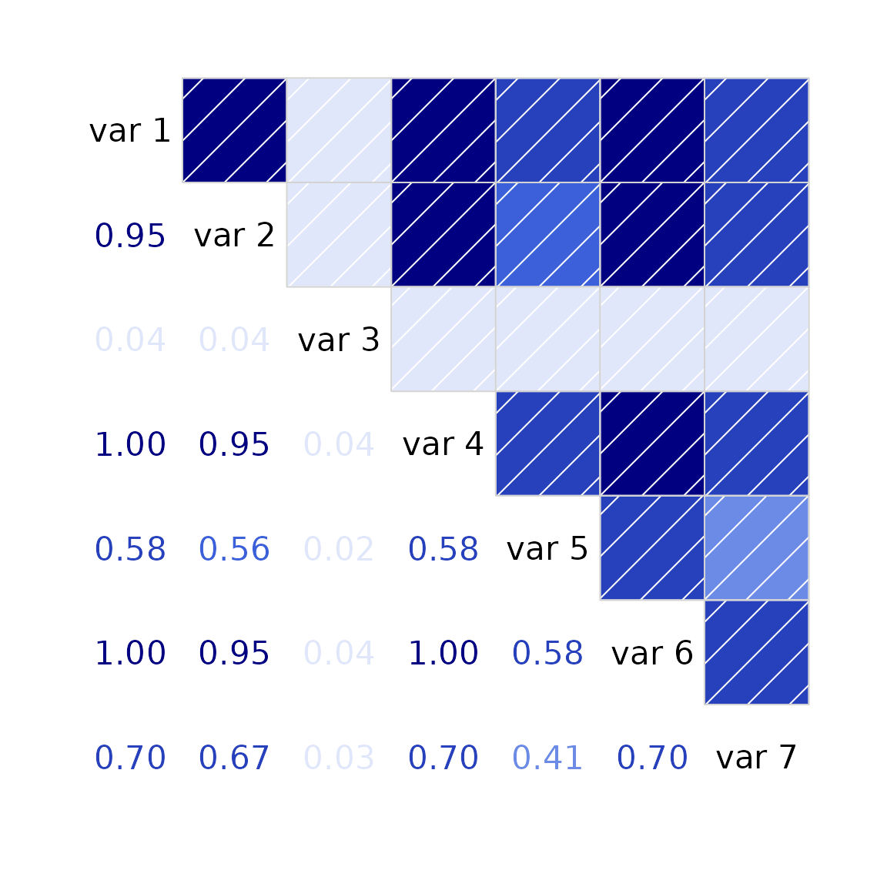

# Finding the nearest proper correlation matrix

Consider the following matrix, as might arise from calculating
covariance based on pairwise-complete data.

``` r

vv <- matrix(c(100.511, 159.266, 3.888, 59.964, 37.231, 32.944, 68.845,
               159.266, 277.723, 6.161, 95.017, 58.995, 52.203, 109.09, 3.888,
               6.161, 99.831, 2.32, 1.44, 1.274, 2.663, 59.964, 95.017, 2.32,
               35.774, 22.212, 19.655, 41.073, 37.231, 58.995, 1.44, 22.212,
               40.432, 12.203, 25.502, 32.944, 52.203, 1.274, 19.655, 12.203,
               10.798, 22.566, 68.845, 109.09, 2.663, 41.073, 25.502, 22.566,
               96.217), nrow=7, byrow=TRUE)
print(vv)
```

    ##         [,1]    [,2]   [,3]   [,4]   [,5]   [,6]    [,7]
    ## [1,] 100.511 159.266  3.888 59.964 37.231 32.944  68.845
    ## [2,] 159.266 277.723  6.161 95.017 58.995 52.203 109.090
    ## [3,]   3.888   6.161 99.831  2.320  1.440  1.274   2.663
    ## [4,]  59.964  95.017  2.320 35.774 22.212 19.655  41.073
    ## [5,]  37.231  58.995  1.440 22.212 40.432 12.203  25.502
    ## [6,]  32.944  52.203  1.274 19.655 12.203 10.798  22.566
    ## [7,]  68.845 109.090  2.663 41.073 25.502 22.566  96.217

This is not a proper covariance matrix (it has a negative eigenvalue).

``` r

eigen(vv)$values
```

    ## [1]  4.808047e+02  9.965048e+01  4.595154e+01  2.657509e+01  8.304329e+00
    ## [6]  6.685001e-04 -8.147905e-04

If we attempt to use the [`cov2cor()`](https://rdrr.io/r/stats/cor.html)
function to convert the covariance matrix to a correlation matrix, we
find the largest correlation values are slightly larger than 1.0.

``` r

cc <- cov2cor(vv)
max(cc) # 1.000041
```

    ## [1] 1.000041

If this is passed to the `corrgram` function, it will issue a warning
that the input data is not a correlation matrix and then calculate
pairwise correlations of the columns, resulting in a non-sensical graph.

There are several packages with functions that can be used to force the
correlation matrix to be an actual, positive-definite correlation
matrix. Two are given here.

## psych

``` r

require(psych)
```

    ## Loading required package: psych

``` r

cc2 <- psych::cor.smooth(cc)
```

    ## Warning in psych::cor.smooth(cc): Matrix was not positive definite, smoothing
    ## was done

``` r

max(cc2)
```

    ## [1] 1

## sfsmisc

``` r

library(sfsmisc)
# nearcor uses 'identical' and says the matrix is not symmetric
isSymmetric(cc) # TRUE
```

    ## [1] TRUE

``` r

identical(cc, t(cc)) # FALSE
```

    ## [1] FALSE

``` r

# round slightly to make it symmetric
cc3 <- nearcor(round(cc,12))$cor
max(cc3)
```

    ## [1] 1

After converting the matrix to a valid correlation matrix, an accurate
corrgram can be created:

``` r

require(corrgram)
```

    ## Loading required package: corrgram

``` r

corrgram(cc2, lower=panel.cor)
```

    ## Warning in par(usr): argument 1 does not name a graphical parameter
    ## Warning in par(usr): argument 1 does not name a graphical parameter
    ## Warning in par(usr): argument 1 does not name a graphical parameter
    ## Warning in par(usr): argument 1 does not name a graphical parameter
    ## Warning in par(usr): argument 1 does not name a graphical parameter
    ## Warning in par(usr): argument 1 does not name a graphical parameter
    ## Warning in par(usr): argument 1 does not name a graphical parameter
    ## Warning in par(usr): argument 1 does not name a graphical parameter
    ## Warning in par(usr): argument 1 does not name a graphical parameter
    ## Warning in par(usr): argument 1 does not name a graphical parameter
    ## Warning in par(usr): argument 1 does not name a graphical parameter
    ## Warning in par(usr): argument 1 does not name a graphical parameter
    ## Warning in par(usr): argument 1 does not name a graphical parameter
    ## Warning in par(usr): argument 1 does not name a graphical parameter
    ## Warning in par(usr): argument 1 does not name a graphical parameter
    ## Warning in par(usr): argument 1 does not name a graphical parameter
    ## Warning in par(usr): argument 1 does not name a graphical parameter
    ## Warning in par(usr): argument 1 does not name a graphical parameter
    ## Warning in par(usr): argument 1 does not name a graphical parameter
    ## Warning in par(usr): argument 1 does not name a graphical parameter
    ## Warning in par(usr): argument 1 does not name a graphical parameter


