# Examples for the corrgram package

### Abstract

The `corrgram` package is an implementation of correlograms. This
vignette reproduces most of the figures in Friendly (2002).

### Setup

``` r

library("knitr")
opts_chunk$set(fig.align="center", fig.width=6, fig.height=6)
options(width=90)
```

The data are 11 measures of performance and salary for 263 baseball
players in the 1986 baseball season in the United States. The data were
used in 1988 Data Expo at the Joint Statistical Meetings.

The first 6 rows of the data and the upper-left corner of the
correlation matrix are given below.

``` r

library("corrgram")
head(baseball)
```

    ##             Name League Team Position Atbat Hits Homer Runs RBI Walks Years Atbatc Hitsc
    ## 1 Andy Allanson       A  CLE       C    293   66     1   30  29    14     1    293    66
    ## 2 Alan Ashby          N  HOU       C    315   81     7   24  38    39    14   3449   835
    ## 3 Alvin Davis         A  SEA       1B   479  130    18   66  72    76     3   1624   457
    ## 4 Andre Dawson        N  MON       OF   496  141    20   65  78    37    11   5628  1575
    ## 5 A Galarraga         N  MON       1B   321   87    10   39  42    30     2    396   101
    ## 6 A Griffin           A  OAK       SS   594  169     4   74  51    35    11   4408  1133
    ##   Homerc Runsc RBIc Walksc Putouts Assists Errors Salary   logSal
    ## 1      1    30   29     14     446      33     20     NA       NA
    ## 2     69   321  414    375     632      43     10    475 2.676694
    ## 3     63   224  266    263     880      82     14    480 2.681241
    ## 4    225   828  838    354     200      11      3    500 2.698970
    ## 5     12    48   46     33     805      40      4     92 1.963788
    ## 6     19   501  336    194     282     421     25    750 2.875061

``` r

round(cor(baseball[, 5:14], use="pair"),2)
```

    ##        Atbat Hits Homer Runs  RBI Walks Years Atbatc Hitsc Homerc
    ## Atbat   1.00 0.97  0.59 0.91 0.82  0.67  0.05   0.24  0.25   0.24
    ## Hits    0.97 1.00  0.56 0.92 0.81  0.64  0.04   0.23  0.26   0.20
    ## Homer   0.59 0.56  1.00 0.65 0.86  0.48  0.12   0.22  0.22   0.49
    ## Runs    0.91 0.92  0.65 1.00 0.80  0.73  0.00   0.19  0.20   0.23
    ## RBI     0.82 0.81  0.86 0.80 1.00  0.62  0.15   0.29  0.31   0.44
    ## Walks   0.67 0.64  0.48 0.73 0.62  1.00  0.14   0.28  0.28   0.33
    ## Years   0.05 0.04  0.12 0.00 0.15  0.14  1.00   0.92  0.90   0.73
    ## Atbatc  0.24 0.23  0.22 0.19 0.29  0.28  0.92   1.00  1.00   0.80
    ## Hitsc   0.25 0.26  0.22 0.20 0.31  0.28  0.90   1.00  1.00   0.78
    ## Homerc  0.24 0.20  0.49 0.23 0.44  0.33  0.73   0.80  0.78   1.00

### Figure 2

Figure 2 shows two ways to graphically display the correlation matrix
using the
[`panel.shade()`](http://kwstat.github.io/corrgram/reference/corrgram.md)
and
[`panel.pie()`](http://kwstat.github.io/corrgram/reference/corrgram.md)
functions.

``` r

vars2 <- c("Assists","Atbat","Errors","Hits","Homer","logSal",
           "Putouts","RBI","Runs","Walks","Years")
corrgram(baseball[,vars2], order=TRUE,
         main="Baseball data PC2/PC1 order",
         lower.panel=panel.shade, upper.panel=panel.pie,
         diag.panel=panel.minmax, text.panel=panel.txt)
```

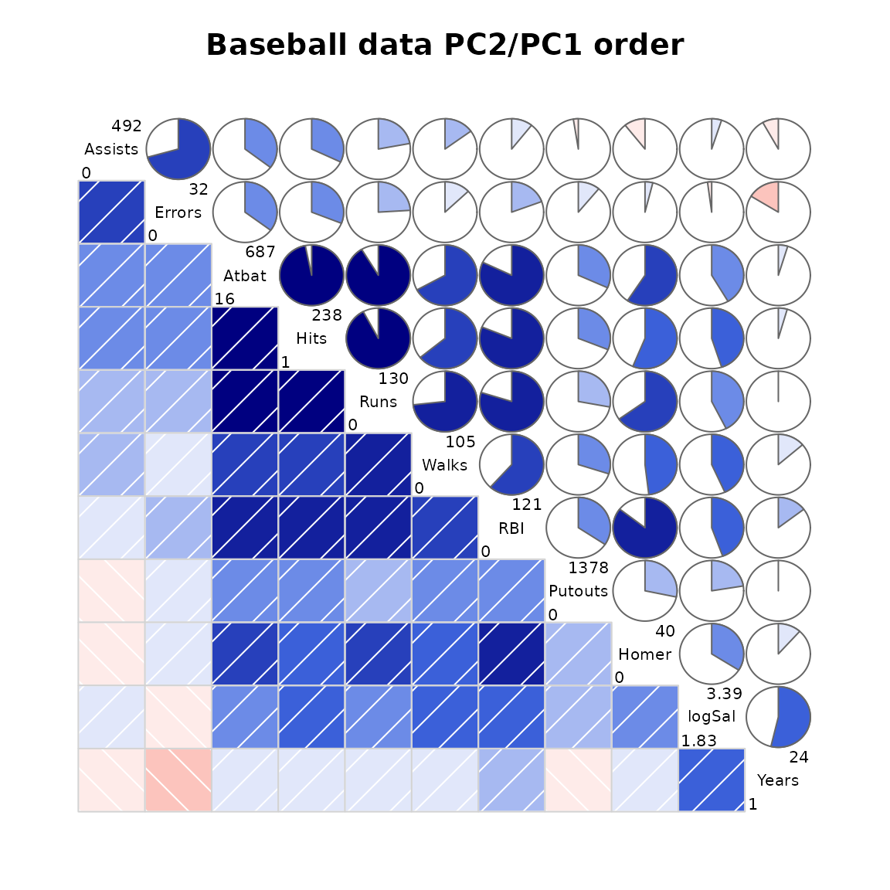

### Figure 3

Figure 3 shows an eigenvector plot of the correlation matrix. This forms
the basis of the orderings of the variables in the corrgram in Figure 4b
in the next section, beginning with “AtBat” and then moving
counter-clockwise up to “Years”. Note: Eigenvectors are unique only up
to a change of sign.

``` r

baseball.cor <- cor(baseball[,vars2], use='pair')
baseball.eig <- eigen(baseball.cor)$vectors[,1:2]
e1 <- baseball.eig[,1]
e2 <- baseball.eig[,2]
plot(e1,e2,col='white', xlim=range(e1,e2), ylim=range(e1,e2))
text(e1,e2, rownames(baseball.cor), cex=1)
title("Eigenvector plot of baseball data")
arrows(0, 0, e1, e2, cex=0.5, col="red", length=0.1)
```

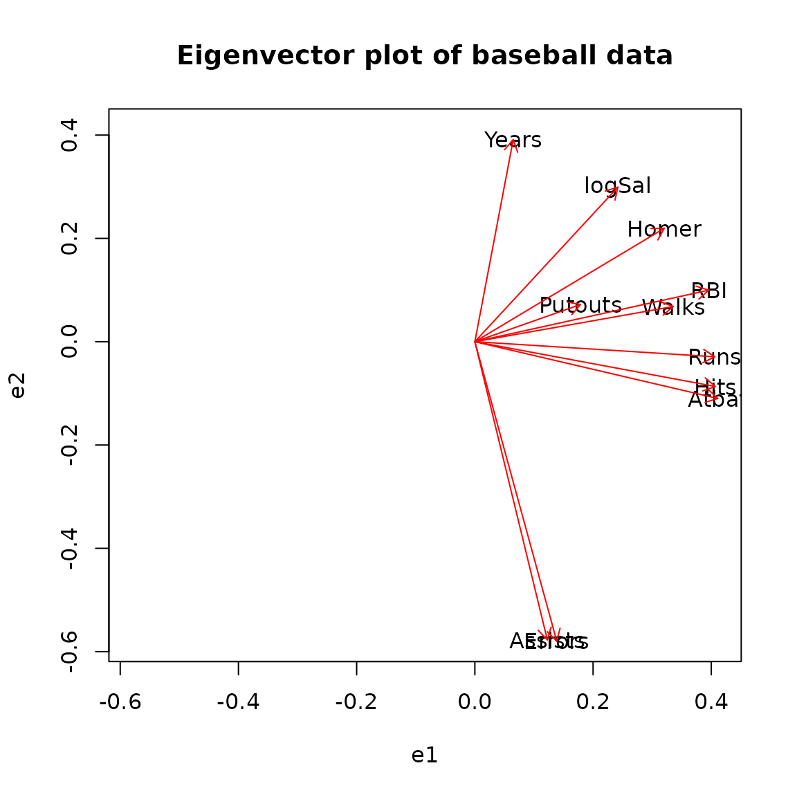

### Figure 4a, 4b

In figure 4a the variables are sorted in the alphabetical order as given
in the data.

In figure 4b, the variables are sorted according to the principal
component ordering in Figure 3 to look for possible clustering of the
variables. It is not surprising to see that more times at bat is
strongly correlated with a higher number of hits and a higher number of
runs.

``` r

corrgram(baseball[,vars2], main="Baseball data (alphabetic order)")
```

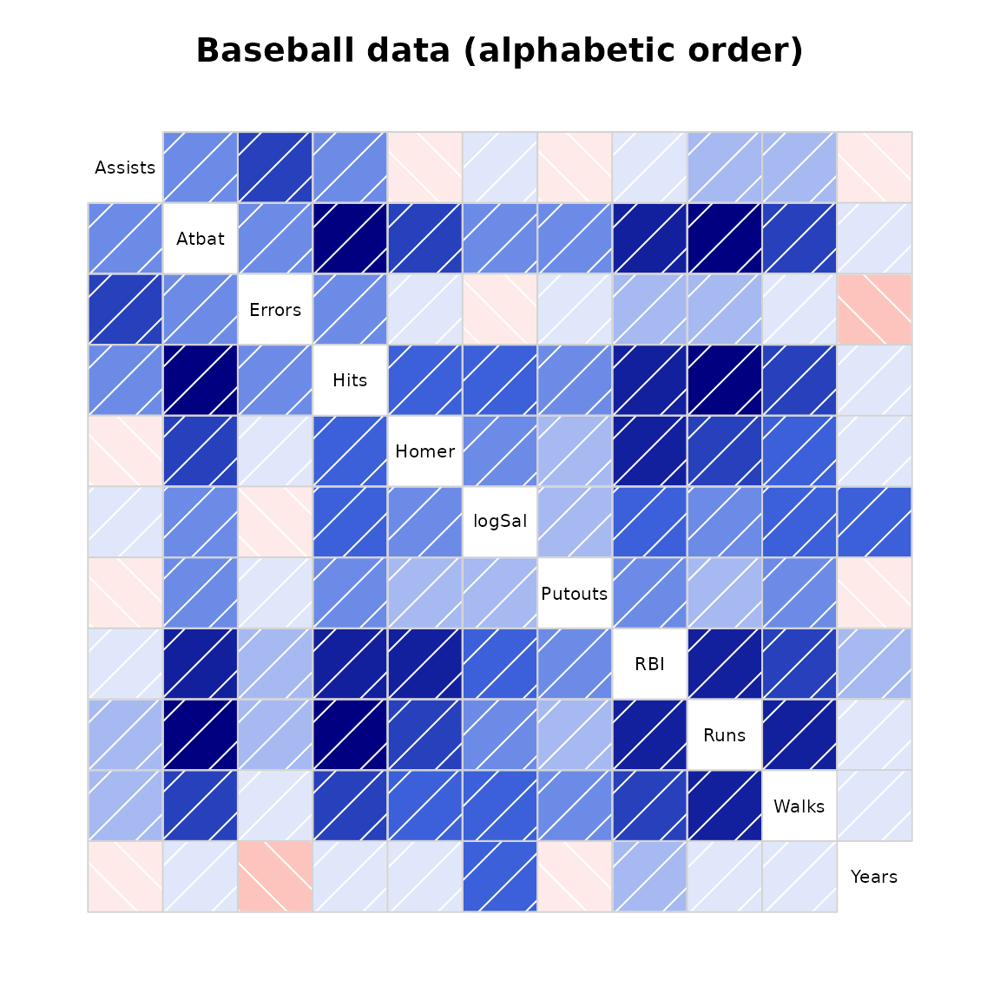

``` r

corrgram(baseball[,vars2], order=TRUE,
         main="Baseball data (PC order)",
         panel=panel.shade, text.panel=panel.txt)
```

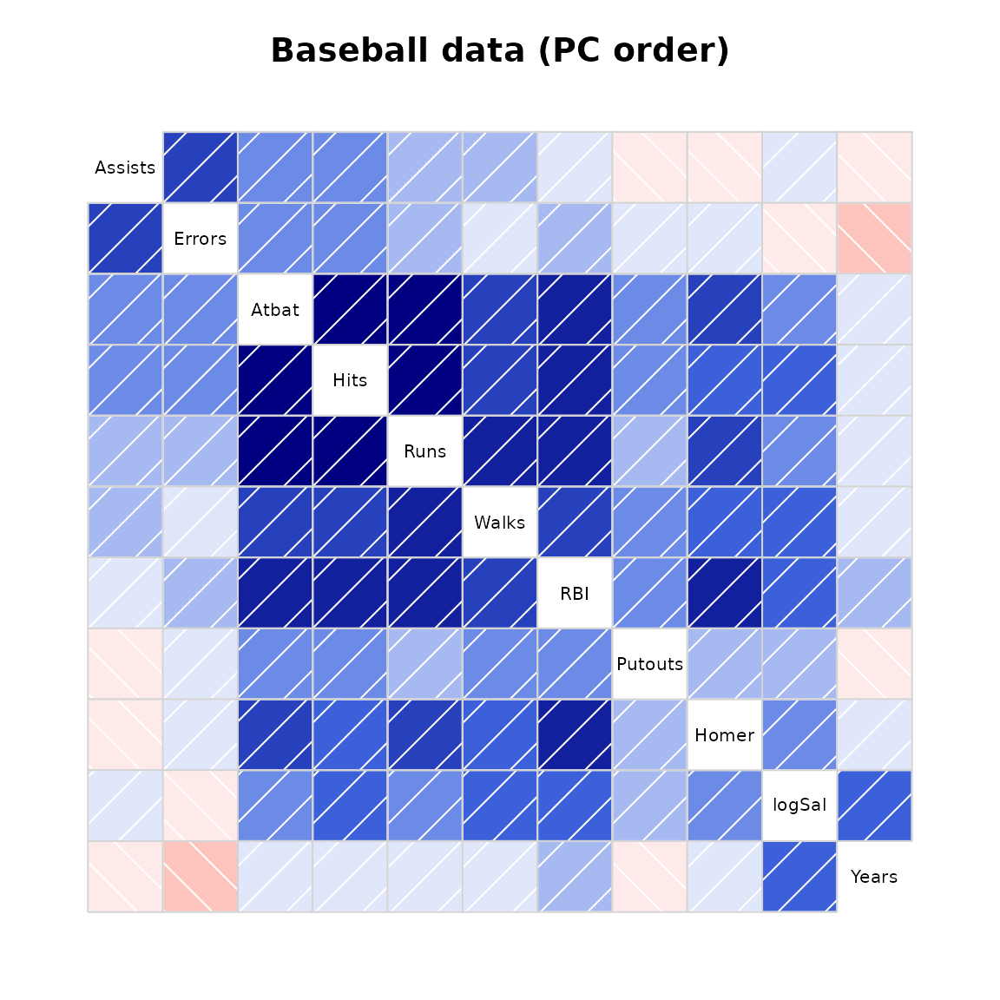

### Figure 5

Figure 5 shows a corrgram for all numeric variables in the dataframe.
Non-numeric columns in the data are ignored.

``` r

corrgram(baseball, order=TRUE, main="Baseball data (PC order)")
```

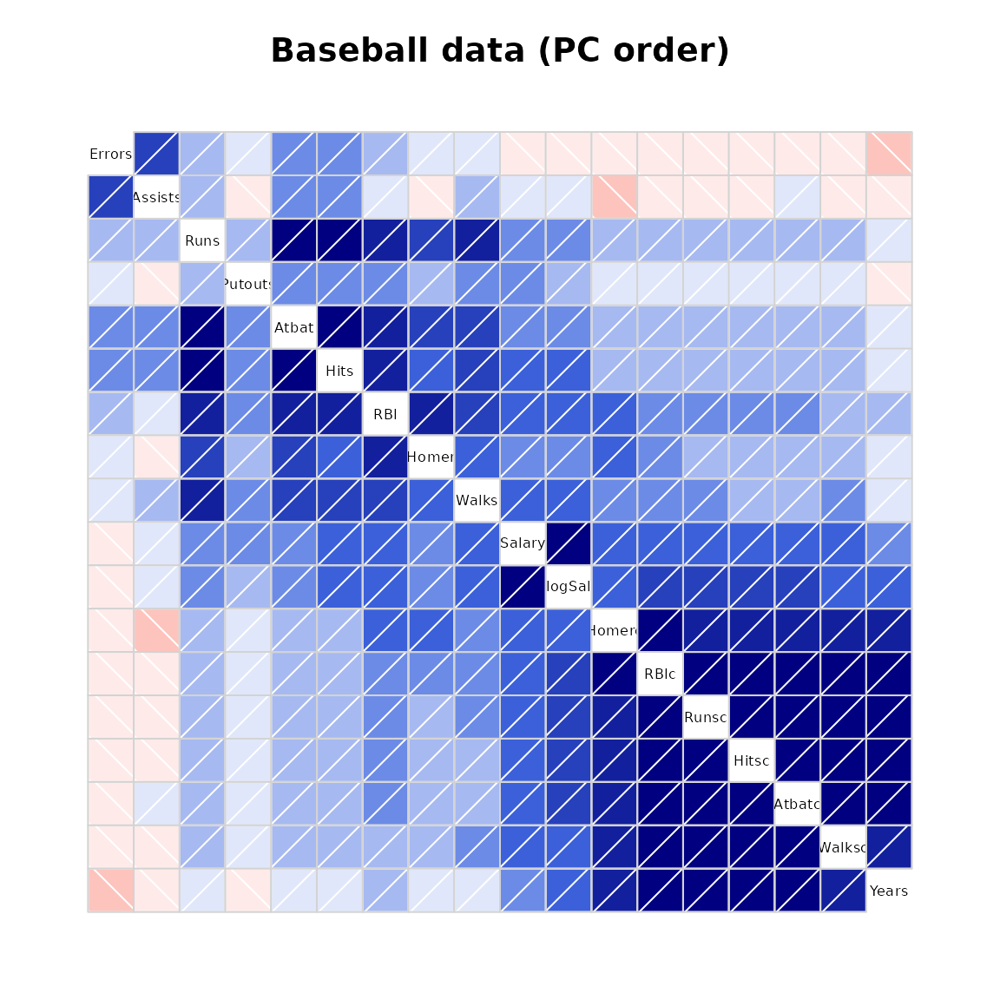

### Figure 6.

Figure 6 shows a corrgram of automotive data on 74 different models of
cars from 1979. There are two obvious groups of variables

Note, the arrangement is slightly different from Friendly.

``` r

corrgram(auto, order=TRUE, main="Auto data (PC order)")
```

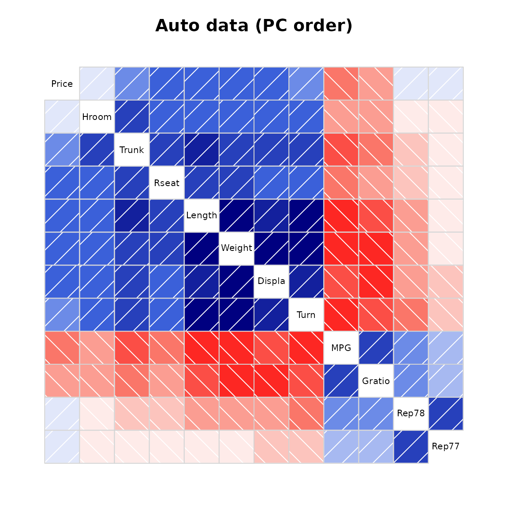

### Figure 7.

The inverse of the correlation matrix expresses conditional dependence
and independence of the variables.

The variables are sorted in the same order as in figure 4. One example
interpretation is: controlling for all other variables, there is still a
large correlation between Years and log Salary.

``` r

rinv <- function(r){
  # r is a correlation matrix
  # calculate r inverse and scale to correlation matrix
  # Derived from Michael Friendly's SAS code

  ri <- solve(r)
  s <- diag(ri)
  s <- diag(sqrt(1/s))
  ri <- s %*% ri %*% s
  n <- nrow(ri)
  ri <- ri * (2*rep(1,n) - matrix(1, n, n))
  diag(ri) <- 1  # Should already be 1, but could be 1 + epsilon
  colnames(ri) <- rownames(ri) <- rownames(r)
  return(ri)
}

vars7 <- c("Years", "logSal", "Homer", "Putouts", "RBI", "Walks",
           "Runs", "Hits", "Atbat", "Errors", "Assists")
cb <- cor(baseball[,vars7], use="pair")
corrgram(-rinv(cb), main=expression(paste("Baseball data ", R^-1)))
```

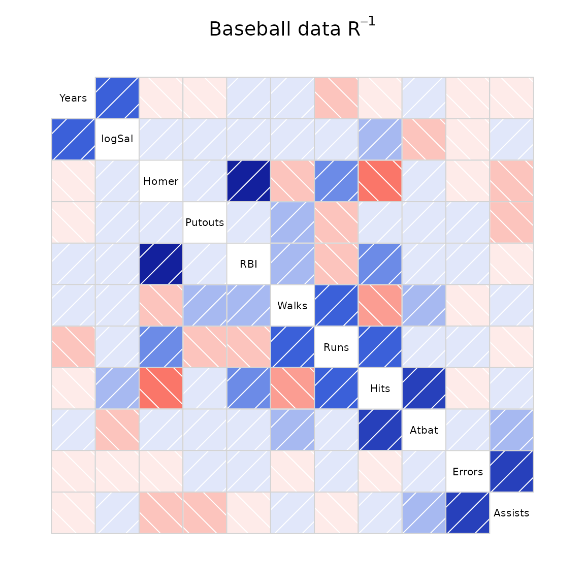

### Figure 8

Figure 8 shows a partial independence corrgram for the automotive data,
when Price and MPG are partialed out.

``` r

require(Matrix) # For block diagonal function
```

    ## Loading required package: Matrix

``` r

partial <- function(r, xvar){
  # r is a correlation matrix
  # Calculate partial correlation of y|x
  yvar <- setdiff(colnames(r), xvar)
  ri <- r[yvar,yvar] - r[yvar,xvar] %*% solve(r[xvar,xvar]) %*% r[xvar,yvar]
  s <- diag(ri)
  s <- diag(sqrt(1/s))
  ri <- s %*% ri %*% s
  ri <- as.matrix(Matrix::bdiag(ri, r[xvar, xvar]))
  diag(ri) <- 1  # Should already be 1, but could be 1 + epsilon
  colnames(ri) <- rownames(ri) <- c(yvar, xvar)
  return(ri)
}

vars8a <- c("Gratio", "Rep78", "Rep77", "Hroom", "Trunk", "Rseat",
            "Length", "Weight", "Displa", "Turn")
vars8b <- c("MPG", "Price")
vars8 <- c(vars8a, vars8b)
auto.cor <- cor(auto[, vars8], use="pair")
auto.par <- partial(auto.cor, vars8b)
corrgram(auto.par,
         lower.panel=panel.pie, upper.panel=panel.pie,
         main="Auto data, partialing out Price,MPG")
```

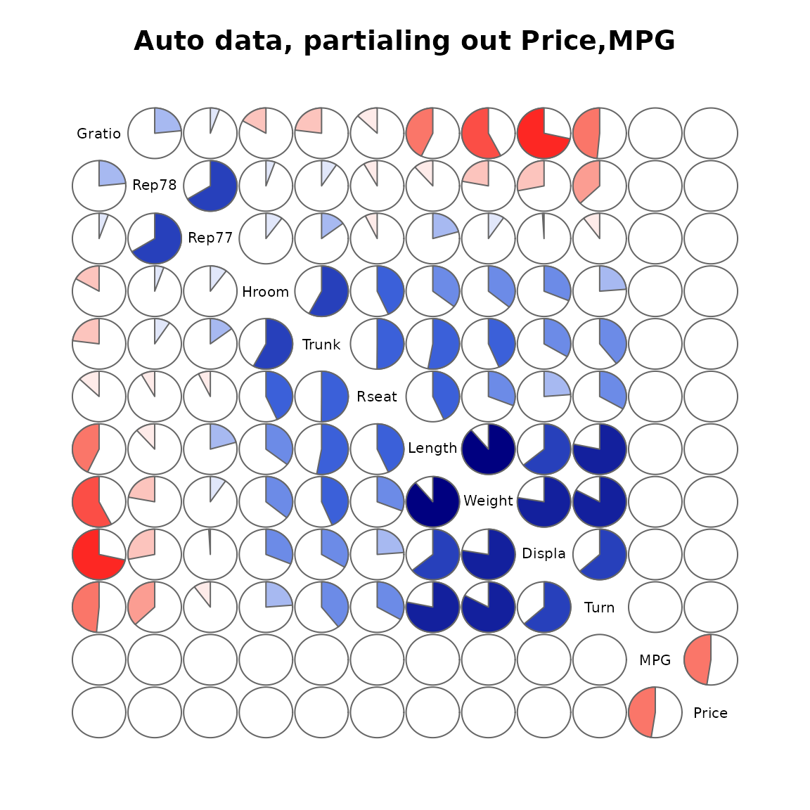

### Figure 11

Figure 11 provides another way to display the data, using both ellipses
and loess lines. Long, narrow ellipses represent high correlations while
circular ellipses represent low correlations.

``` r

corrgram(baseball[,vars2], order=TRUE,
         main="Baseball correlation ellipses",
         panel=panel.ellipse,
         text.panel=panel.txt, diag.panel=panel.minmax)
```

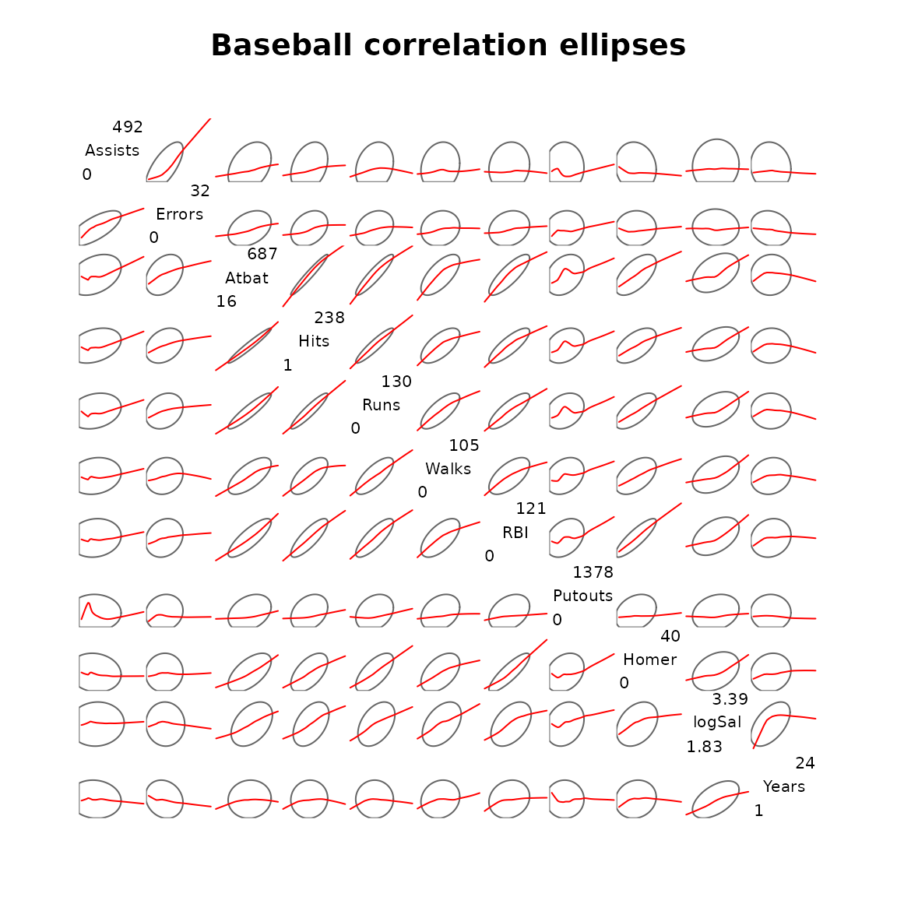

## Further examples

Demonstrate density panel, correlation confidence panel

``` r

corrgram(iris,
         main="Iris data with example panel functions",
         lower.panel=panel.pts, upper.panel=panel.conf,
         diag.panel=panel.density)
```

    ## Warning in par(usr): argument 1 does not name a graphical parameter
    ## Warning in par(usr): argument 1 does not name a graphical parameter
    ## Warning in par(usr): argument 1 does not name a graphical parameter
    ## Warning in par(usr): argument 1 does not name a graphical parameter
    ## Warning in par(usr): argument 1 does not name a graphical parameter
    ## Warning in par(usr): argument 1 does not name a graphical parameter

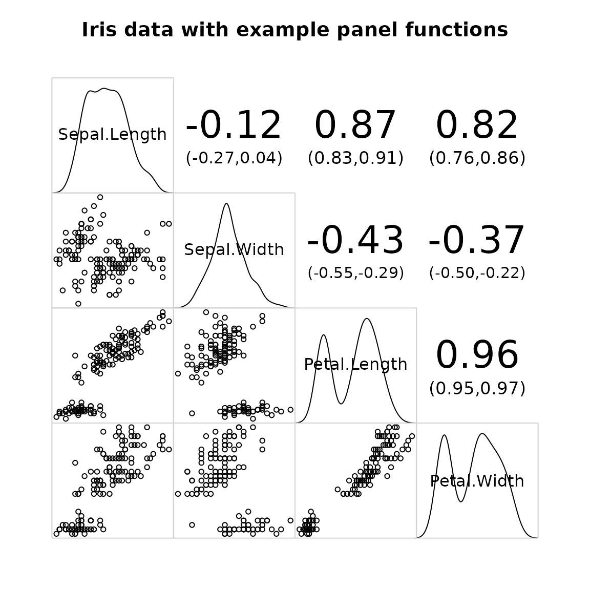

Demonstrate panel.bar, panel.ellipse, panel.minmax, col.regions

``` r

corrgram(auto, order=TRUE,
         main="Auto data (PC order)",
         lower.panel=corrgram::panel.ellipse,
         upper.panel=panel.bar, diag.panel=panel.minmax,
         col.regions=colorRampPalette(c("darkgoldenrod4", "burlywood1",
                                        "darkkhaki", "darkgreen")))
```

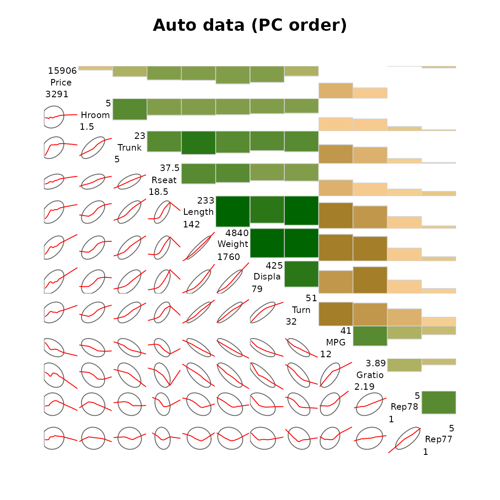

### Correlation matrix

The `vote` data is a matrix.

``` r

# 'vote' is a correlation matrix, not a data frame
corrgram(vote, order=TRUE,
         upper.panel=panel.cor, main="vote")
```

    ## Warning in par(usr): argument 1 does not name a graphical parameter
    ## Warning in par(usr): argument 1 does not name a graphical parameter
    ## Warning in par(usr): argument 1 does not name a graphical parameter
    ## Warning in par(usr): argument 1 does not name a graphical parameter
    ## Warning in par(usr): argument 1 does not name a graphical parameter
    ## Warning in par(usr): argument 1 does not name a graphical parameter
    ## Warning in par(usr): argument 1 does not name a graphical parameter
    ## Warning in par(usr): argument 1 does not name a graphical parameter
    ## Warning in par(usr): argument 1 does not name a graphical parameter
    ## Warning in par(usr): argument 1 does not name a graphical parameter
    ## Warning in par(usr): argument 1 does not name a graphical parameter
    ## Warning in par(usr): argument 1 does not name a graphical parameter
    ## Warning in par(usr): argument 1 does not name a graphical parameter
    ## Warning in par(usr): argument 1 does not name a graphical parameter
    ## Warning in par(usr): argument 1 does not name a graphical parameter
    ## Warning in par(usr): argument 1 does not name a graphical parameter
    ## Warning in par(usr): argument 1 does not name a graphical parameter
    ## Warning in par(usr): argument 1 does not name a graphical parameter
    ## Warning in par(usr): argument 1 does not name a graphical parameter
    ## Warning in par(usr): argument 1 does not name a graphical parameter
    ## Warning in par(usr): argument 1 does not name a graphical parameter
    ## Warning in par(usr): argument 1 does not name a graphical parameter
    ## Warning in par(usr): argument 1 does not name a graphical parameter
    ## Warning in par(usr): argument 1 does not name a graphical parameter
    ## Warning in par(usr): argument 1 does not name a graphical parameter
    ## Warning in par(usr): argument 1 does not name a graphical parameter
    ## Warning in par(usr): argument 1 does not name a graphical parameter
    ## Warning in par(usr): argument 1 does not name a graphical parameter
    ## Warning in par(usr): argument 1 does not name a graphical parameter
    ## Warning in par(usr): argument 1 does not name a graphical parameter
    ## Warning in par(usr): argument 1 does not name a graphical parameter
    ## Warning in par(usr): argument 1 does not name a graphical parameter
    ## Warning in par(usr): argument 1 does not name a graphical parameter
    ## Warning in par(usr): argument 1 does not name a graphical parameter
    ## Warning in par(usr): argument 1 does not name a graphical parameter
    ## Warning in par(usr): argument 1 does not name a graphical parameter
    ## Warning in par(usr): argument 1 does not name a graphical parameter
    ## Warning in par(usr): argument 1 does not name a graphical parameter
    ## Warning in par(usr): argument 1 does not name a graphical parameter
    ## Warning in par(usr): argument 1 does not name a graphical parameter
    ## Warning in par(usr): argument 1 does not name a graphical parameter
    ## Warning in par(usr): argument 1 does not name a graphical parameter
    ## Warning in par(usr): argument 1 does not name a graphical parameter
    ## Warning in par(usr): argument 1 does not name a graphical parameter
    ## Warning in par(usr): argument 1 does not name a graphical parameter
    ## Warning in par(usr): argument 1 does not name a graphical parameter
    ## Warning in par(usr): argument 1 does not name a graphical parameter
    ## Warning in par(usr): argument 1 does not name a graphical parameter
    ## Warning in par(usr): argument 1 does not name a graphical parameter
    ## Warning in par(usr): argument 1 does not name a graphical parameter
    ## Warning in par(usr): argument 1 does not name a graphical parameter
    ## Warning in par(usr): argument 1 does not name a graphical parameter
    ## Warning in par(usr): argument 1 does not name a graphical parameter
    ## Warning in par(usr): argument 1 does not name a graphical parameter
    ## Warning in par(usr): argument 1 does not name a graphical parameter
    ## Warning in par(usr): argument 1 does not name a graphical parameter
    ## Warning in par(usr): argument 1 does not name a graphical parameter
    ## Warning in par(usr): argument 1 does not name a graphical parameter
    ## Warning in par(usr): argument 1 does not name a graphical parameter
    ## Warning in par(usr): argument 1 does not name a graphical parameter
    ## Warning in par(usr): argument 1 does not name a graphical parameter
    ## Warning in par(usr): argument 1 does not name a graphical parameter
    ## Warning in par(usr): argument 1 does not name a graphical parameter
    ## Warning in par(usr): argument 1 does not name a graphical parameter
    ## Warning in par(usr): argument 1 does not name a graphical parameter
    ## Warning in par(usr): argument 1 does not name a graphical parameter

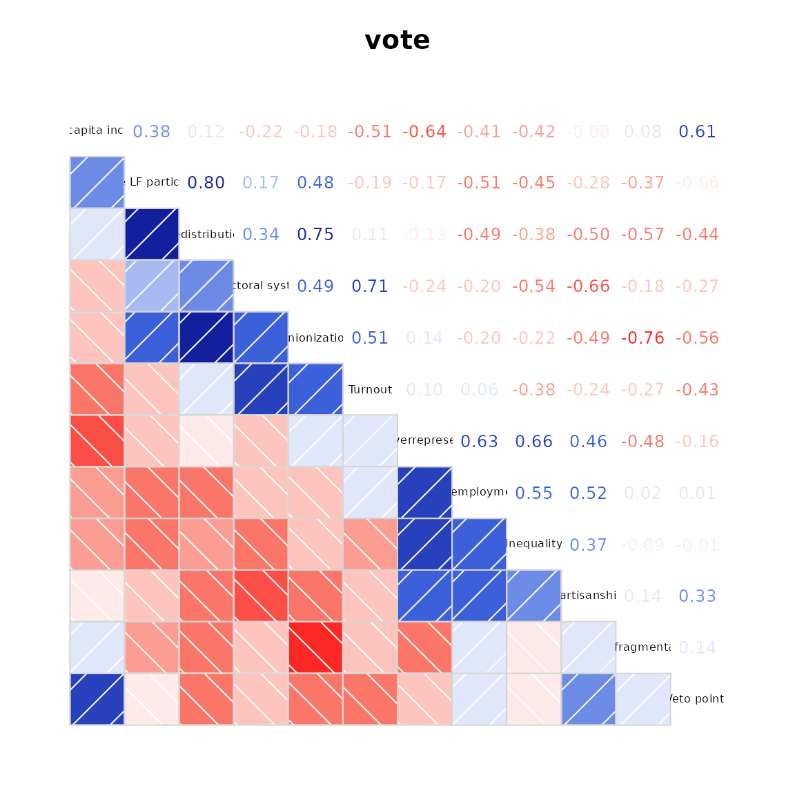

### Ratings data

An example showing one way to plot ratings data.

``` r

load(url("https://github.com/alexanderrobitzsch/sirt/blob/master/data/data.ratings3.rda?raw=true"))

# jitter first, so the upper/lower panels are symmetric
data.ratings3 <- transform(data.ratings3,
                           c2=jitter(crit2), c3=jitter(crit3),
                           c4=jitter(crit4), c6=jitter(crit6))
                           
library(corrgram)
panel.raters <- function (x, y, corr = NULL, col.regions, cor.method, ...) {
  if (!is.null(corr)) 
    return()
  plot.xy(xy.coords(x, y), type = "p", ...)
  abline(lm(y ~ x))
  box(col = "lightgray")
}
corrgram(data.ratings3[,7:10], diag=panel.density, lower.panel=panel.raters, upper.panel=panel.conf)
```

    ## Warning in par(usr): argument 1 does not name a graphical parameter
    ## Warning in par(usr): argument 1 does not name a graphical parameter
    ## Warning in par(usr): argument 1 does not name a graphical parameter
    ## Warning in par(usr): argument 1 does not name a graphical parameter
    ## Warning in par(usr): argument 1 does not name a graphical parameter
    ## Warning in par(usr): argument 1 does not name a graphical parameter

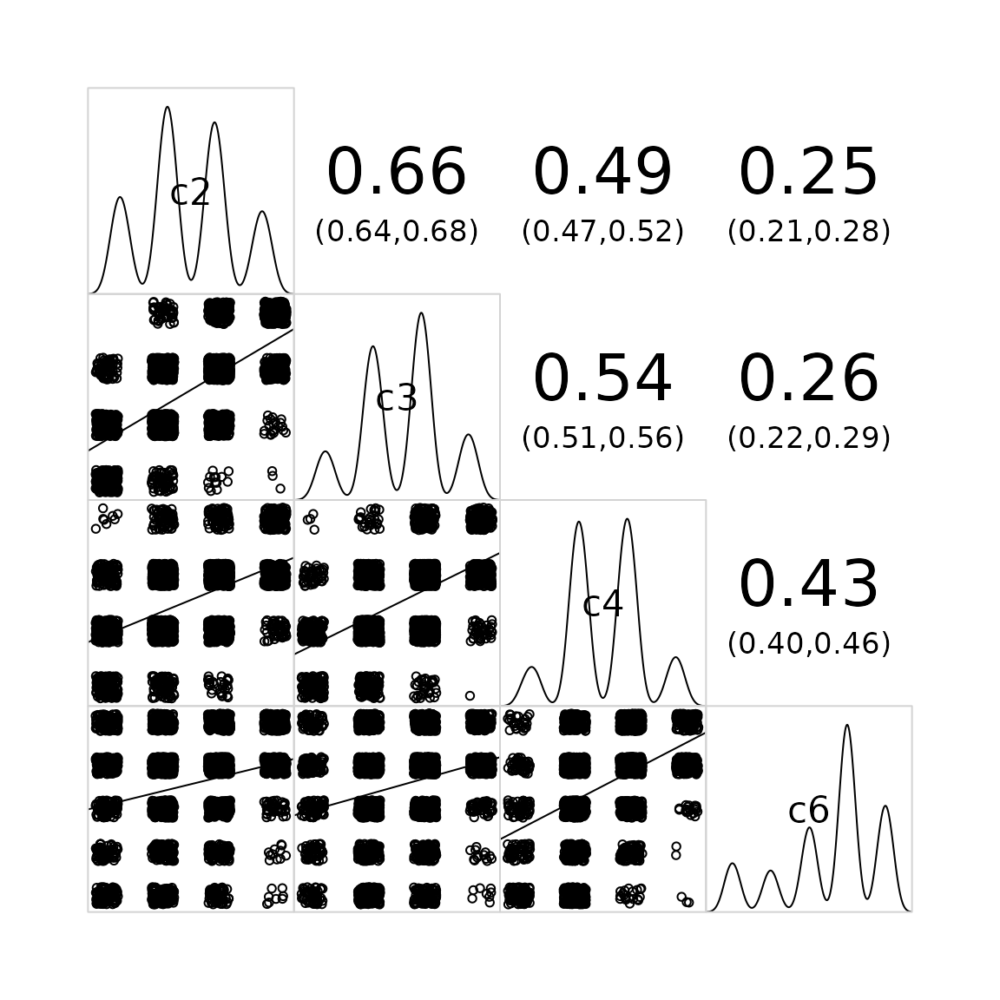

``` r

sessionInfo()
```

    ## R version 4.6.0 (2026-04-24)
    ## Platform: x86_64-pc-linux-gnu
    ## Running under: Ubuntu 24.04.4 LTS
    ## 
    ## Matrix products: default
    ## BLAS:   /usr/lib/x86_64-linux-gnu/openblas-pthread/libblas.so.3 
    ## LAPACK: /usr/lib/x86_64-linux-gnu/openblas-pthread/libopenblasp-r0.3.26.so;  LAPACK version 3.12.0
    ## 
    ## locale:
    ##  [1] LC_CTYPE=C.UTF-8       LC_NUMERIC=C           LC_TIME=C.UTF-8       
    ##  [4] LC_COLLATE=C.UTF-8     LC_MONETARY=C.UTF-8    LC_MESSAGES=C.UTF-8   
    ##  [7] LC_PAPER=C.UTF-8       LC_NAME=C              LC_ADDRESS=C          
    ## [10] LC_TELEPHONE=C         LC_MEASUREMENT=C.UTF-8 LC_IDENTIFICATION=C   
    ## 
    ## time zone: UTC
    ## tzcode source: system (glibc)
    ## 
    ## attached base packages:
    ## [1] stats     graphics  grDevices utils     datasets  methods   base     
    ## 
    ## other attached packages:
    ## [1] Matrix_1.7-5  corrgram_1.14 knitr_1.51   
    ## 
    ## loaded via a namespace (and not attached):
    ##  [1] digest_0.6.39     desc_1.4.3        R6_2.6.1          fastmap_1.2.0    
    ##  [5] xfun_0.57         lattice_0.22-9    cachem_1.1.0      htmltools_0.5.9  
    ##  [9] rmarkdown_2.31    lifecycle_1.0.5   cli_3.6.6         grid_4.6.0       
    ## [13] sass_0.4.10       pkgdown_2.2.0     textshaping_1.0.5 jquerylib_0.1.4  
    ## [17] systemfonts_1.3.2 compiler_4.6.0    tools_4.6.0       ragg_1.5.2       
    ## [21] evaluate_1.0.5    bslib_0.10.0      ellipse_0.5.0     yaml_2.3.12      
    ## [25] jsonlite_2.0.0    rlang_1.2.0       fs_2.1.0

### References

Friendly, Michael. 2002. “Corrgrams: Exploratory Displays for
Correlation Matrices.” *The American Statistician* 56: 316–24.
<https://doi.org/10.1198/000313002533>.
