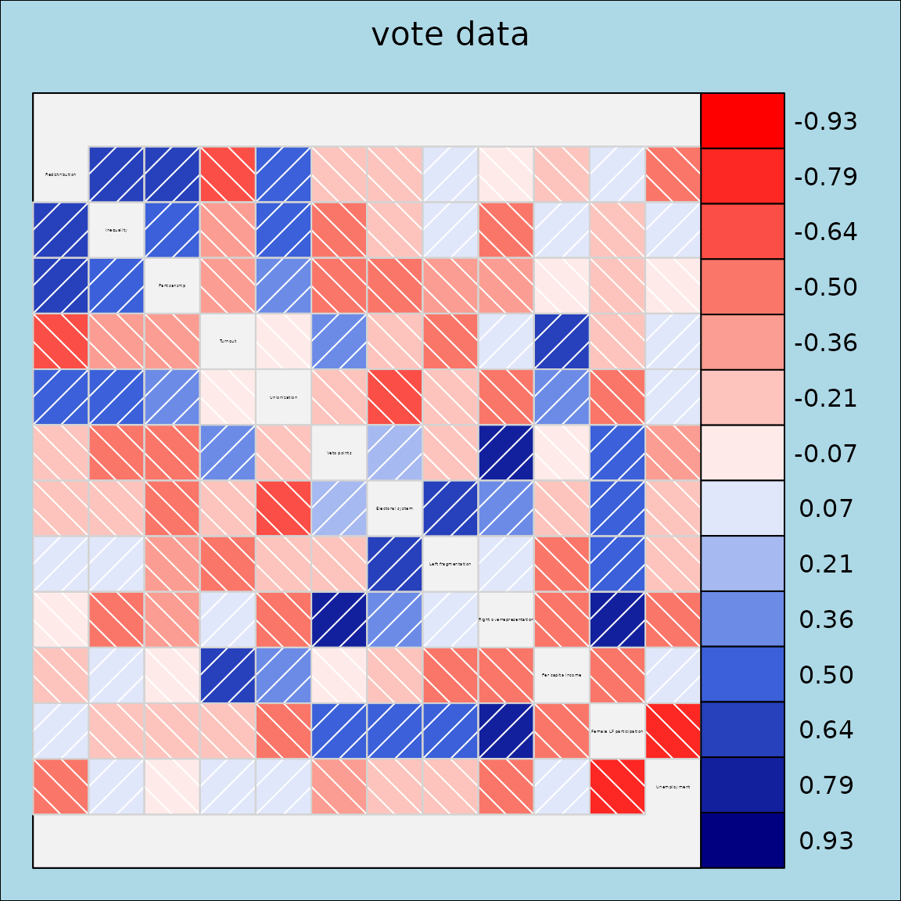
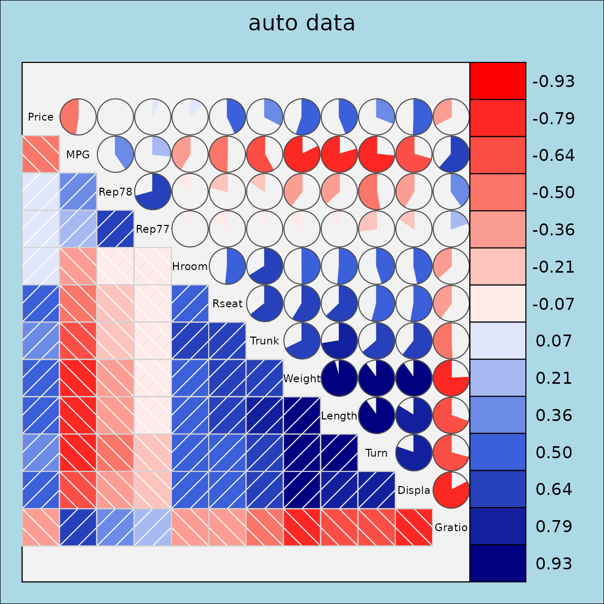

# Examples of grid corrgrams

## Package overview

The `corrgram` package provides functions for creating corrgrams using
three different graphics systems, base, grid, and lattice.

Base R graphics + single function
[`corrgram()`](http://kwstat.github.io/corrgram/reference/corrgram.md)
for dataframes or matrices. + Enables most features found in the paper
by @friendly2002corrgrams. - No automatic legend. - Not easily combined
with other graphics.

`lattice` graphics + Separate panel functions for
[`lattice::levelplot()`](https://rdrr.io/pkg/lattice/man/levelplot.html)
for dataframes and
[`lattice::splom()`](https://rdrr.io/pkg/lattice/man/splom.html) for
correlation matrices. + Enables automatic legend. + Enables corrgrams
conditioned on other variables. + Can be combined with other lattice
graphics for complex figures. - Not feature complete compared to base R.

`grid` graphics + single function
[`corrgram2()`](http://kwstat.github.io/corrgram/reference/corrgram2.md)
for either dataframes or correlation matrices. + Enables automatic
legend. + Can be combined with other grid graphics for complex
figures. - Not feature complete compared to base R. + Faster than base R
when evaluated inside Positron.

## This vignette

This vignette demonstrates how to create corrgrams using `grid` graphics
with the
[`corrgram2()`](http://kwstat.github.io/corrgram/reference/corrgram2.md)
function and a variety of panel functions for visualizing correlations
in different ways.

## Grid Panels for corrgram2

This vignette demonstrates the use of grid-based panels in `corrgram2`,
which provide flexible and modern correlation matrix visualizations.

## Correlation matrix corrgram in grid

The `vote` dataset contains roll call voting records for US Senators.
Here we show a grid-based correlation plot with absolute correlations,
ordering, and a legend.

``` r

corrgram2(vote, abs = TRUE, order = TRUE, legend = TRUE, title = "vote data")
```



## Dataframe corrgram in grid

The `auto` dataset contains various automobile attributes. We select a
subset of numeric variables and display a grid-based correlation plot
using the fill panel.

``` r

vars6 <- setdiff(colnames(auto), c("Model", "Origin"))
corrgram2(auto[, vars6], 
          lower.panel = grid_panel.shade, upper.panel=grid_panel.pie,
          title = "auto data", legend = TRUE)
```


