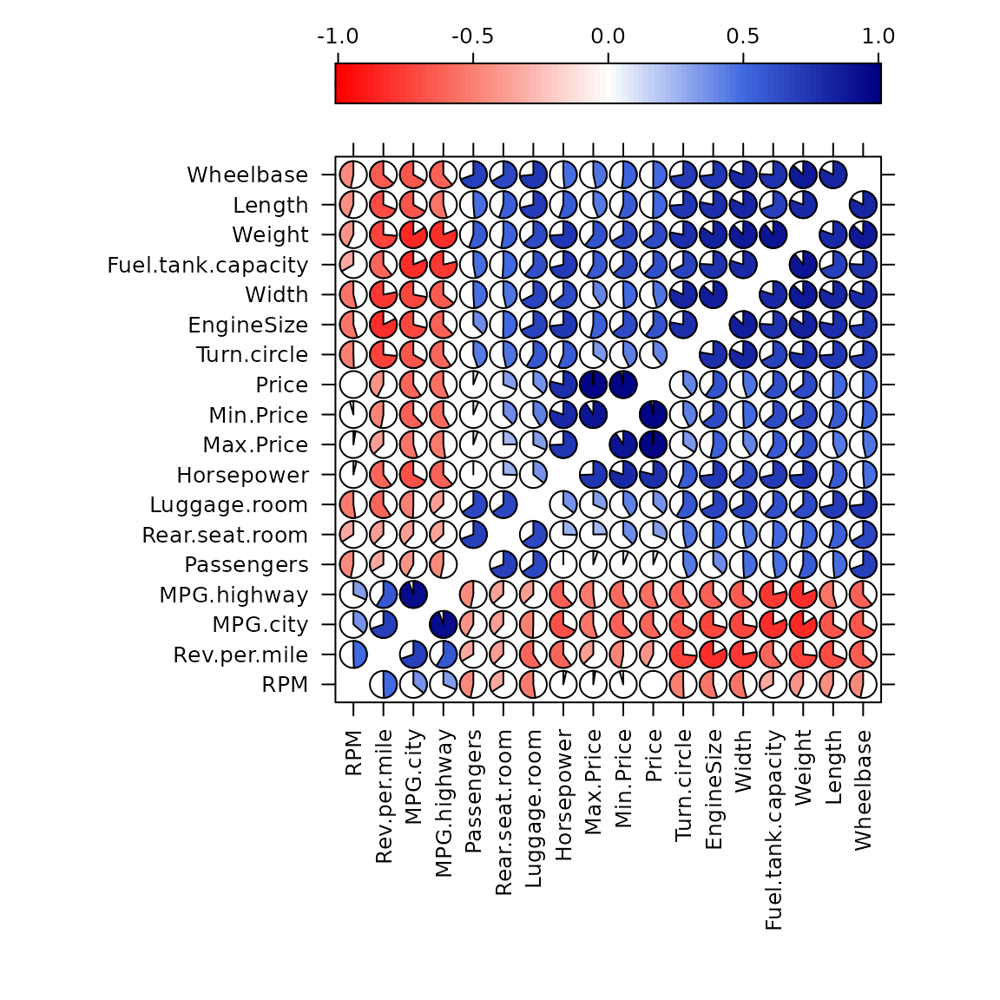
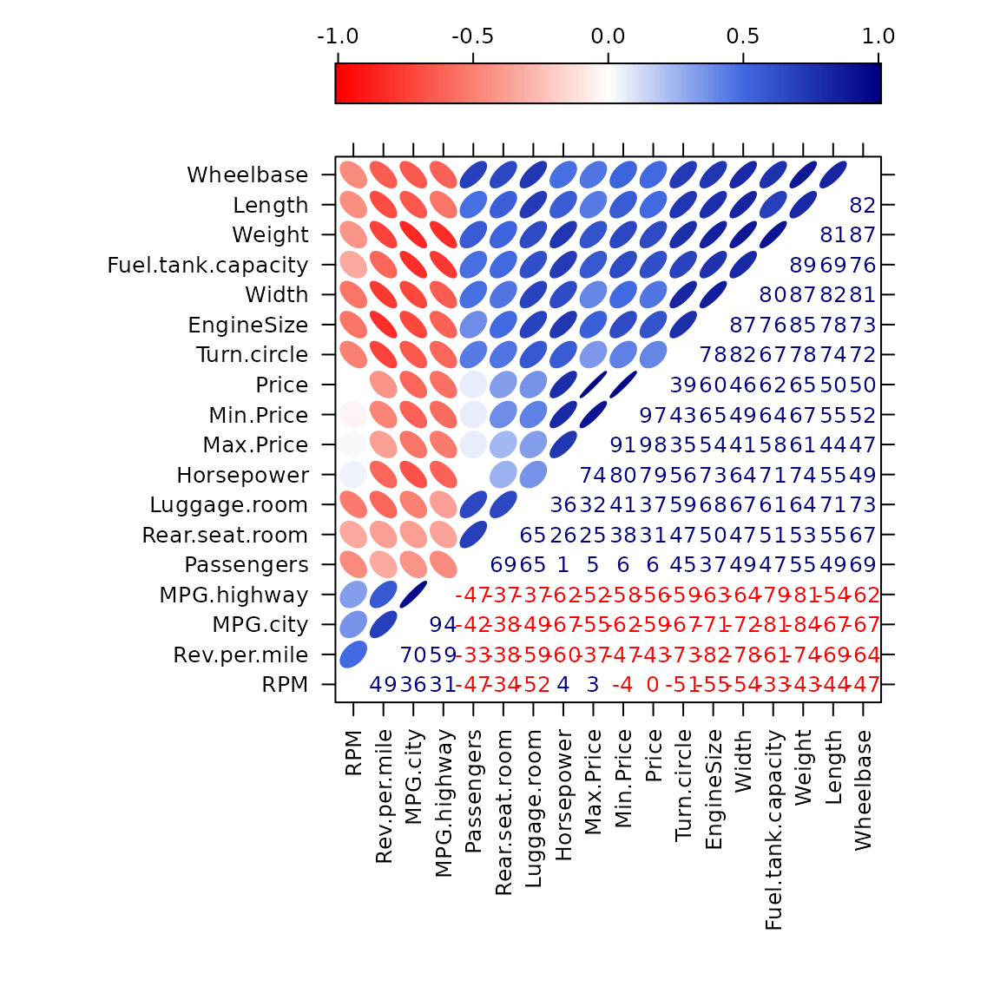
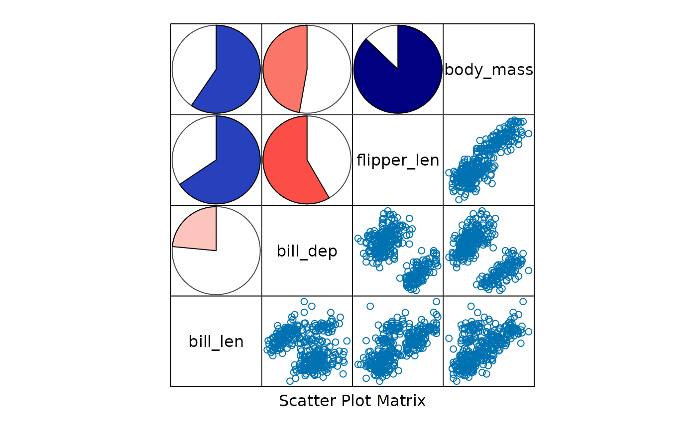
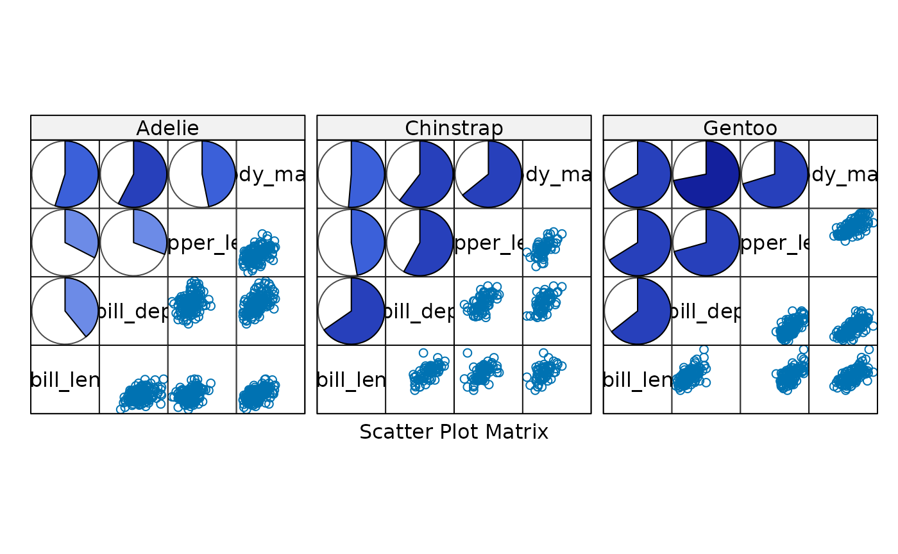
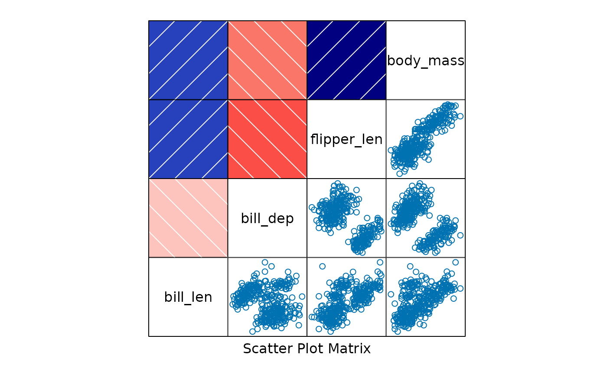
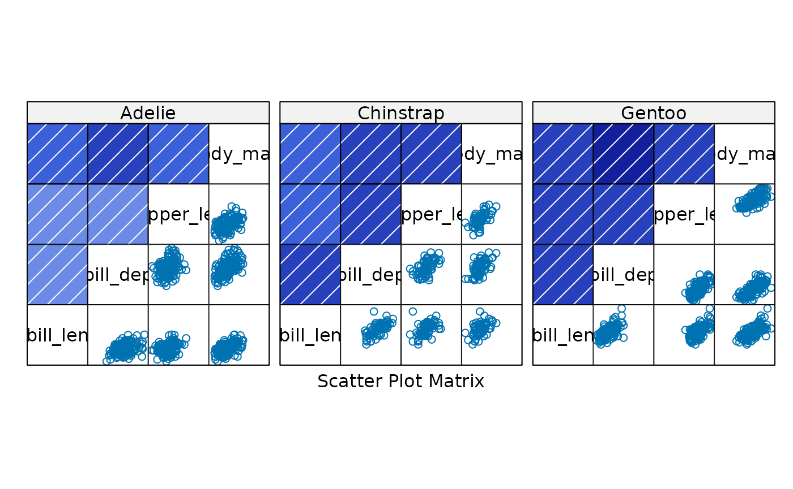
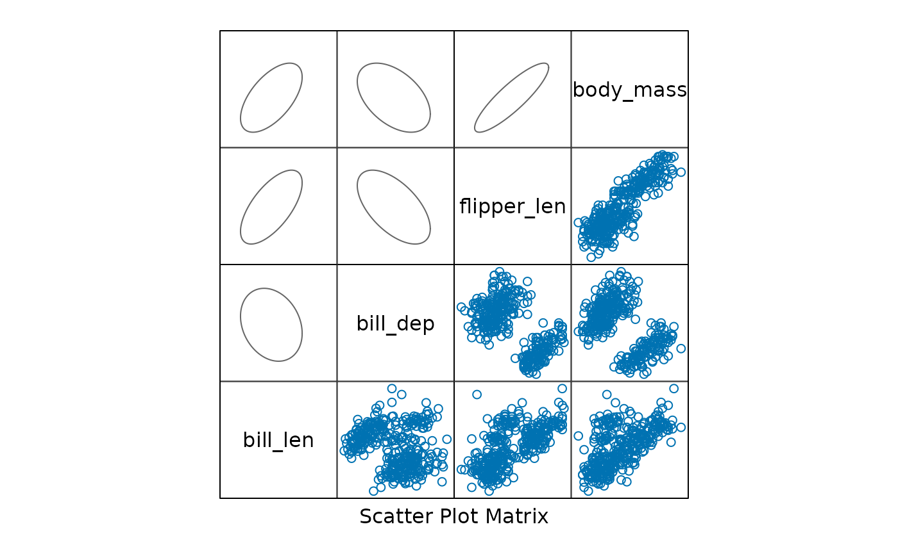
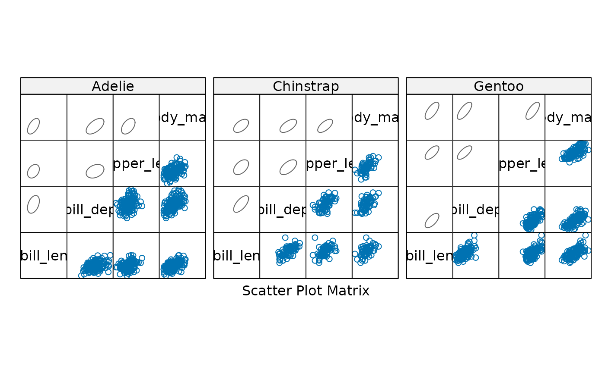
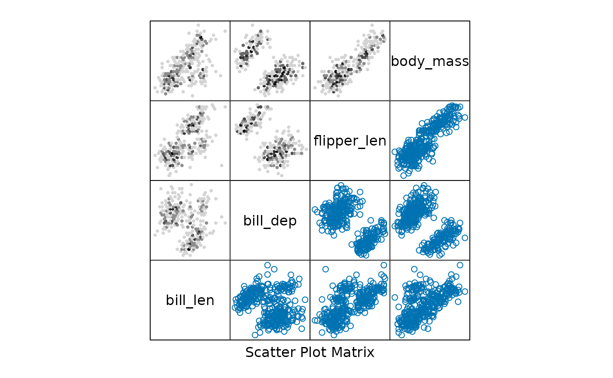
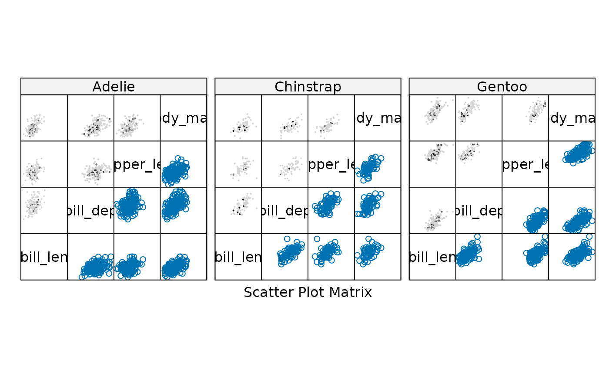

# Examples of lattice corrgrams

## Abstract

The base R `corrgram` function can accept either a correlation matrix or
a dataframe.

If you want to create a corrgram using `lattice` graphics, you can use
some custom panel functions provided in the `corrgram` package along
with the
[`lattice::splom()`](https://rdrr.io/pkg/lattice/man/splom.html) or
[`lattice::levelplot()`](https://rdrr.io/pkg/lattice/man/levelplot.html)
functions. An example of each type of corrgram is shown below.

## Correlation matrix corrgram in lattice

The [`levelplot()`](https://rdrr.io/pkg/lattice/man/levelplot.html)
function in lattice only has a single plotting region, so does not (by
default) suppot upper and lower panels. However, you can write a custom
panel function with different glyphs above and below the diagonal. See
the
[`panel.ellipse()`](http://kwstat.github.io/corrgram/reference/corrgram.md)
example below.

Using [`splom()`](https://rdrr.io/pkg/lattice/man/splom.html) makes it
easy to include a color scale next to the corrgram.

``` r

library("lattice")
library("corrgram")
```

    ## 
    ## Attaching package: 'corrgram'

    ## The following object is masked from 'package:lattice':
    ## 
    ##     panel.fill

``` r

# The easiest way to have an automatic color key is to set the theme
opar <- trellis.par.get()
trellis.par.set(
  regions=list(col=colorRampPalette(c("red","salmon","white","royalblue","navy")))
)

# Create a correlation matrix
library(MASS) # foor Cars93
cor.Cars93 <-   cor(Cars93[, !sapply(Cars93, is.factor)], use = "pair")
ord <- order.dendrogram(as.dendrogram(hclust(dist(cor.Cars93))))
cars93 <- cor.Cars93[ord,ord]
head(cars93)
```

    ##                       RPM Rev.per.mile   MPG.city MPG.highway Passengers
    ## RPM             1.0000000    0.4947642  0.3630451   0.3134687 -0.4671376
    ## Rev.per.mile    0.4947642    1.0000000  0.6958570   0.5874968 -0.3349756
    ## MPG.city        0.3630451    0.6958570  1.0000000   0.9439358 -0.4168559
    ## MPG.highway     0.3134687    0.5874968  0.9439358   1.0000000 -0.4663858
    ## Passengers     -0.4671376   -0.3349756 -0.4168559  -0.4663858  1.0000000
    ## Rear.seat.room -0.3421751   -0.3770096 -0.3843469  -0.3666844  0.6941337
    ##                Rear.seat.room Luggage.room   Horsepower   Max.Price   Min.Price
    ## RPM                -0.3421751   -0.5248449  0.036688212  0.02501478 -0.04259816
    ## Rev.per.mile       -0.3770096   -0.5927915 -0.600313870 -0.37402421 -0.47039499
    ## MPG.city           -0.3843469   -0.4948936 -0.672636151 -0.54781090 -0.62287544
    ## MPG.highway        -0.3666844   -0.3716291 -0.619043685 -0.52256074 -0.57996581
    ## Passengers          0.6941337    0.6533166  0.009263668  0.05321592  0.06123644
    ## Rear.seat.room      1.0000000    0.6519675  0.256731532  0.24725979  0.37664210
    ##                       Price Turn.circle EngineSize      Width
    ## RPM            -0.004954931  -0.5056506 -0.5478978 -0.5397211
    ## Rev.per.mile   -0.426395113  -0.7331596 -0.8240086 -0.7804604
    ## MPG.city       -0.594562163  -0.6663889 -0.7100032 -0.7205344
    ## MPG.highway    -0.560680362  -0.5936833 -0.6267946 -0.6403592
    ## Passengers      0.057860074   0.4490247  0.3727212  0.4899786
    ## Rear.seat.room  0.311498819   0.4663276  0.5027498  0.4656176
    ##                Fuel.tank.capacity     Weight     Length  Wheelbase
    ## RPM                    -0.3333452 -0.4279315 -0.4412493 -0.4678123
    ## Rev.per.mile           -0.6097098 -0.7352642 -0.6902333 -0.6368238
    ## MPG.city               -0.8131444 -0.8431385 -0.6662390 -0.6671076
    ## MPG.highway            -0.7860386 -0.8106581 -0.5428974 -0.6153842
    ## Passengers              0.4720951  0.5532730  0.4852941  0.6940544
    ## Rear.seat.room          0.5096887  0.5262505  0.5499578  0.6672586

``` r

# lattice corrgram using pie-shaped glyphs
levelplot(cars93, xlab = NULL, ylab = NULL,
          at = do.breaks(c(-1.01, 1.01), 101), panel = levelplot.pie,
          scales = list(x = list(rot = 90)), colorkey = list(space = "top") )
```



``` r

# lattice corrgram using ellipse-shaped glyphs above the diagonal
# and value labels below the diagonal
levelplot(cars93, xlab = NULL, ylab = NULL,
          at = do.breaks(c(-1.01, 1.01), 101), panel = levelplot.ellipse,
          label=TRUE,
          scales = list(x = list(rot = 90)), colorkey = list(space = "top") )
```



## Scatterplot matrix corrgram in lattice

Since the
[`lattice::splom()`](https://rdrr.io/pkg/lattice/man/splom.html)
function supports conditioning on a factor, we can use it to create
corrgrams that are conditioned on a factor.

The penguins data provides a nice example of Simpson’s paradox, where
the overall correlation between two variables can be negative, but the
correlation within each group (species) can be positive.

``` r

pengvars <- c("bill_len", "bill_dep", "flipper_len", "body_mass")
splom(~penguins[ , pengvars], upper.panel=splom.pie, pscales=0)
```



``` r

splom(~penguins[ , pengvars]|penguins$species, upper.panel=splom.pie, pscales=0)
```



``` r

splom(~penguins[ , pengvars], upper.panel=splom.shade, pscales=0)
```



``` r

splom(~penguins[ , pengvars]|penguins$species, upper.panel=splom.shade, pscales=0)
```



``` r

splom(~penguins[ , pengvars], upper.panel=splom.ellipse, pscales=0)
```



``` r

splom(~penguins[ , pengvars]|penguins$species, upper.panel=splom.ellipse, pscales=0)
```



You can also use the `hexbin` package to create hexagonal binning plots
in the upper panels of the scatterplot matrix. This is useful when you
have a large number of points and want to visualize the density of
points in different regions of the plot.

``` r

# Hexbin
library(lattice)
library(hexbin)
splom(~penguins[ , pengvars], upper.panel=hexbin::panel.hexbinplot, pscales=0)
```



``` r

splom(~penguins[ , pengvars]|penguins$species, upper.panel=hexbin::panel.hexbinplot, pscales=0)
```


